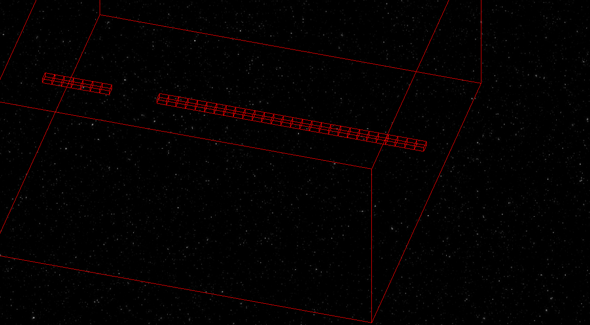

# 3D Snake Game in C++ with SFML

## Description
This project is a 3D Snake game written in C++ using the SFML graphics library. The goal was to create a 3D rendering without using any 3D library or game engine, relying solely on linear algebra to develop the game.

## Features
- 3D rendering of the game grid and the snake.
- Movement and teleportation of the snake in 3D space.
- Collision handling and snake growth.
- Rotation and orthographic projection to visualize the game in 3D.

## Dependencies
- SFML (Simple and Fast Multimedia Library)

## Installation on Debian

1. Update the package list:

sudo apt update

2. Install the SFML library:

sudo apt install libsfml-dev

3. Clone the project repository:

git clone https://github.com/Zyphorah/Snake3D.git

4. Change into the project directory:

cd Snake3D

5. Compile the project with CMake:

   mkdir -p build
   cd build
   cmake ..
   cmake --build .

6. Run the game:

   ./Snake3D

### Snake Controls
- A: Move the snake to the right.
- D: Move the snake to the left.
- W: Move the snake forward (vertical axis).
- S: Move the snake backward (opposite of W).
- Q: Move the snake down (decrease altitude).
- E: Move the snake up (increase altitude).

The snake grows by one cube after moving four squares. Be careful not to collide with the snake's body while moving.

### Camera Controls
- Use the arrow keys to adjust the camera viewing angle.
